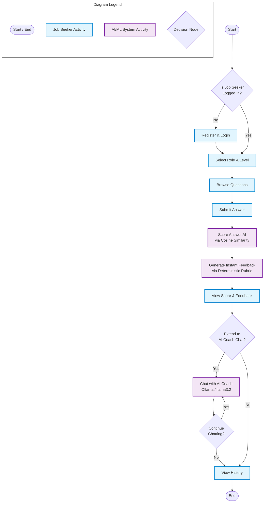

```mermaid
flowchart TD
    %% Styling and Legend
    classDef userAct fill:#e1f5fe,stroke:#0288d1,stroke-width:2px;
    classDef sysAct fill:#f3e5f5,stroke:#7b1fa2,stroke-width:2px;
    classDef legendBox fill:#ffffff,stroke:#333,stroke-width:1px;

    subgraph Legend [Diagram Legend]
        direction TB
        L1([Start / End])
        L2[Job Seeker Activity]:::userAct
        L3[AI/ML System Activity]:::sysAct
        L4{Decision Node}
    end
    class Legend legendBox

    %% Main Execution Flow
    Start([Start]) --> AuthCheck{Is Job Seeker<br>Logged In?}
    
    AuthCheck -- No --> Login[Register & Login]:::userAct
    Login --> Setup[Select Role & Level]:::userAct
    AuthCheck -- Yes --> Setup
    
    Setup --> Browse[Browse Questions]:::userAct
    Browse --> Submit[Submit Answer]:::userAct
    
    %% System Processing
    Submit --> Score[Score Answer AI<br>via Cosine Similarity]:::sysAct
    Score --> Feedback[Generate Instant Feedback<br>via Deterministic Rubric]:::sysAct
    
    Feedback --> View[View Score & Feedback]:::userAct
    
    View --> ChatDecision{Extend to<br>AI Coach Chat?}
    
    %% RAG / Chat Loop
    ChatDecision -- Yes --> Coach[Chat with AI Coach<br>Ollama / llama3.2]:::sysAct
    Coach --> ContinueDecision{Continue<br>Chatting?}
    ContinueDecision -- Yes --> Coach
    ContinueDecision -- No --> History
    
    ChatDecision -- No --> History[View History]:::userAct
    
    History --> End([End])
```